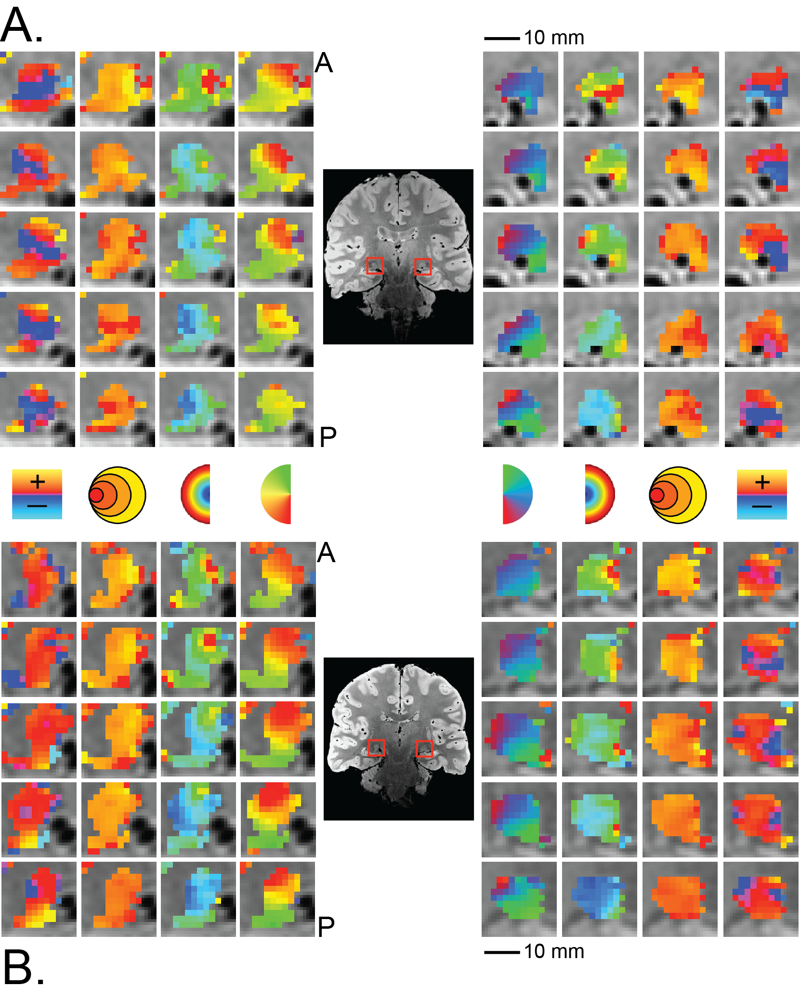

What is a population receptive field?
======================================

A population receptive field (pRF) is a quantitative model of the cumulative response 
of the population of cells contained within a single fMRI voxel [1]_.  The pRF model can 
be used to estimate the response properties of populations of neurons using other measures, such
as EcOG and EEG [2]_.

The pRF model allows us to interpret and predict the responses of a voxel to different stimuli. 
Such models can be designed to describe various sensory [3]_ and cognitive [4]_ processes.  More 
recently, we have used the pRF model to map the retinotopic organization of multiple subcortical 
nuclei [5]_.

References
-----------

.. [1] Dumoulin S, and Wandell BA (2008). Population receptive field estimates
        in human visual cortex. Neuroimage 39: 647-60. 
    
.. [2] Winawer J and Wandell BA (2015). Computational neuroimaging and population receptive
        fields.  Trends in Cognitive Sciences 19: 349-357.
    
.. [3] Thomas JM, Huber E, Stecker E, Boynton G, Saenz M, Fine I (2014) Population receptive 
        field estimates in human auditory cortex. NeuroImage 105: 428-439.
        
.. [4] Harvey BM, Klein BP, Petridou N, Dumoulin SO (2013) Topographic organization of numerosity 
        in the human parietal cortex. Science 341: 1123-1126.
        
.. [5] DeSimone K, Viviano JD, Schneider KA (2015) Population receptive field estimation reveals two 
        new maps in human subcortex. Journal of Neuroscience 35: 9836-9847.